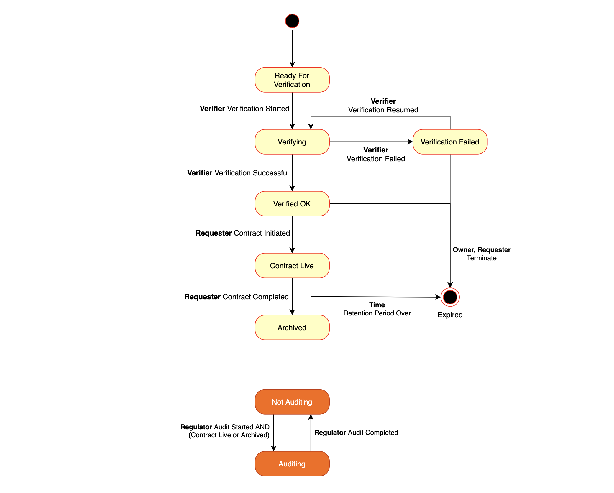

# KYC SDA Example

*Before following this example, make sure you have followed the instructions in [Using Datona for the First Time](README.md#Using-Datona-for-the-First-Time)*

The scenario for this example is of a customer opening an account on an online trading platform, using the platform and then closing the account some time later.  The account opening process includes a Know Your Customer (KYC) check performed by a specialist third party organisation.  To meet legal requirements, the KYC process may be audited by the financial regulator any time up to 5 years after the account has been closed.

All the account data, including the customer's identity and proof of ID, the verifier's KYC records and any customer-related records created by the platform are held in a vault and controlled by a Smart Data Access Contract.  Each category of data or individual piece of data is allocated its own file within the vault so that its read/write/append permissions can be tailored specifically to that data (see [File Permissions](https://datona-lib.readthedocs.io/en/latest/howto.html#file-permissions) for details on files and directories).  The files are as follows:

|File ID|Type|Content|
|---|:---:|---|
|`0x0000000000000000000000000000000000000001`|file|The customer's name and email address|
|`0x0000000000000000000000000000000000000002`|directory|The customer's KYC identity data (copy of passport and proof of address)|
|`0x0000000000000000000000000000000000000003`|directory|The verifier's KYC records specific to this case|
|`0x0000000000000000000000000000000000000004`|file|The verifier's signed conclusion - held in a separate file to give the requester access to the conclusion but not the full KYC records|
|`0x0000000000000000000000000000000000000005`|directory|The requester's records specific to this account|
|`0xFFfFfFffFFfffFFfFFfFFFFFffFFFffffFfFFFfF`|file|A general purpose log file|

Each file and directory has an id, which can be any Ethereum-like hash, with or without mixed-case checksum encoding ([EIP55](https://github.com/ethereum/EIPs/blob/master/EIPS/eip-55.md)).  *(A hash is used to encourage anonymity on the public blockchain and to support the use of hashed filenames if desired)*.  There is no particular meaning to the addresses in the above table, they are just given as examples.

The life-cycle of the account is implemented as a state machine within the Smart Data Access Contract, as seen in the state transition diagram below.  Permission to transition between states is restricted to the appropriate role(s), shown in bold.  In each state, the permissions for each file and each role change to suit the life-cycle.  See the [KYC S-DAC source code](#KYC-S-DAC-Solidity-Code) for details of the permissions in each state.

Since all states, state transition restrictions and file permissions are defined in an S-DAC on a public blockchain, all actors can be confident that their role, access rights and data protection rights will be upheld and can monitor the account process in real time as it progresses through its life-cycle.

<a name="std"></a>


## Overview

This example follows the following steps.  Throughout the example the customer is known as the data **Owner**, the trading platform is the **Requester**, the third-party KYC verification company is the **Verifier** and the financial regulator is the **Regulator**.

This example uses datona-cli to simulate the scenario.  In the real scenario, most of these steps would be performed automatically by the application-layer software: the Owner's Datona IO mobile app, the Requester's server software, the Verifier's employee interface, and the Regulator's auditing software.

The scenario starts with the customer clicking a 'Create Account' button on the platform's website.  This initiates a Smart Data Access Request...


**As a Data Owner, receive and accept a Smart Data Access Request:**

1\. Download the Smart Data Access Request from the Requester;

2\. Deploy the requested smart contract to the kovan testnet;

3\. Create a new data vault on the datonavault.com cloud vault server;

4\. Write the data to the vault;

5\. Inform the Requester that you've accepted the request;


**Explore vault permissions:**

6\. As each actor, try to retrieve the Owner's data from the vault;

7\. As any user, get information about the Smart Data Access Contract;


**As the Verifier, perform the KYC check**

8\. As the Verifier, transition the contract to begin verification and see how permissions have changed;

9\. As the Verifier, retrieve the Owner's data from the vault;

10\. Verifier requests more information from the Owner (Owner updates the vault);

11\. Verifier writes the KYC risk assessment and signature to the vault;

12\. Transition the contract to indicate verification was successful;


**As the Requester, open and run the account**

13\. The Requester checks the Verifier's KYC Signature then opens the account;

14\. Regulator audits the account;

15\. As someone other than the Owner, try to terminate the contract;

16\. Owner closes the online trading account by terminating the contract;

17\. Confirm the permissions are fully restrictive;


**As the Regulator, audit the account again**

18\. Regulator audits the account during the retention period;


**Simulate 5 years have gone by and explore permissions:**

19\. As the Owner, try to delete the vault before the retention period has ended;

20\. Simulate 5 years gone by;

21\. As someone other than the Owner, try to delete the vault;

22\. As the Owner, delete the vault.


### First, let's setup some keys...

For ease of use later, we will create named keys for each actor plus a random different user.  Except for the Requester, it doesn't matter what the keys are for this example, only that they remain unchanged throughout.  Note, the Requester's key must match the signatory in the Smart Data Access Request in this example, so it is hard coded with the ``saveKey`` command. 

```
# generate private keys

> datona generateKey owner
0xc16a409a39ede3f38e212900f8d3afe6aa6a8929

> datona saveKey e68e40257cfee330038c49637fcffff82fae04b9c563f4ea071c20f2eb55063c requester
0x41a60f71063cd7c9e5247d3e7d551f91f94b5c3b

> datona generateKey verifier
0x9cfc1caa62491c88a5299f5064d42a6e09ee3a81

> datona generateKey regulator
0xa13170b7974d316b6787cfa26d3649183c9ff627

> datona generateKey otherUser
0xb0402c1a2fe89117b1fda916a7f7a59612f41c7c


# record public keys

$ owner=`datona getAddress owner`
$ requester=`datona getAddress requester`
$ verifier=`datona getAddress verifier`
$ regulator=`datona getAddress regulator`
$ otherUser=`datona getAddress otherUser`
```

### Fund the addresses

You will need to send some of your KETH from your funded address to each of the 5 addresses since all 5 actors transact with the contract in this example.  Any Ethereum wallet, such as [MyEtherWallet](https://www.myetherwallet.com/), should be able to do this.

### 1. Download the Smart Data Access Request from the Requester

A Smart Data Access Request is a JSON formatted string containing the contract to deploy and how to notify the Requester if you've accepted the request. It is expected that in a real-world application a request would be passed to the owner's app either directly or via a download from a url.  E.g. passed directly via an NFC connection or downloaded from a url provided by a QR code or button on a website. For now we will copy the request string or download from the Requester's server:

Either:

Copy the following and paste into a file named ``request``:

```
{"txn":{"txnType":"SmartDataAccessRequest","version":"0.0.2","contract":{"hash":"3ce36c97d91d3beea9e2b132009bb038ace6a8b901e6fbdf680f74665f3cc8a8"},"api":{"url":{"scheme":"file","host":"77.68.75.133","port":8126},"acceptTransaction":{},"rejectTransaction":{}}},"signature":"45caa29df62858e7bbb54111c029d245cae73195316a6e950a245db39ceaf18d1f55e191c34b7f33249bb15284bc5e009a757d298c766ba9271a6a798105fc6101"}
```

or:

Download from the Requester's server *(the requester's server just happens to be the datonavault.com server in this example!)*:

```
$ requesterServer=http://77.68.75.133:8125
$ datona getRequest $requesterServer/0.0.2/kycRequest --raw >request
```

The ``request`` file will be used later.

The contract hash found in the request identifies the Smart Data Access Contract to be deployed (hash of its runtime bytecode). The contract is the terms and conditions that the Requester wants the Owner to accept and under which the Owner's data will be shared. In this case it is the KYC_SDAC smart contract. (The contract source code [can be found below](#KYC-S-DAC-Solidity-Code)).

Let's copy the contract hash from the request and store it for later:

```
$ contractHash=3ce36c97d91d3beea9e2b132009bb038ace6a8b901e6fbdf680f74665f3cc8a8
```

### 2. Deploy the requested smart contract to the kovan testnet

First we need the contract ABI and bytecode. This can be downloaded from the Requester's server at 77.68.75.133.  Let's create a variable pointing to it to make it easier later.  E.g.

```
$ requesterServer=http://77.68.75.133:8125
$ curl $requesterServer/0.0.2/contract/$contractHash > kyc_sdac

$ contractCode=kyc_sdac
```

Then we will deploy a new instance of the contract on the blockchain.  The contract's constructor takes four parameters: the Ethereum addresses of the Requester, Verifier and Regulator, and the duration of the retention period (in days).

```
$ datona deployContract $contractCode $requester $verifier $regulator 1826 --key owner
0x073C8e6121eF67096c7925f7f9b2C66e3d240a74
```

Copy the output from the deployContract command into an environment variable called ``contract`` - it is the new contract's blockchain address, which we'll need later.
```
$ contract=0x073C8e6121eF67096c7925f7f9b2C66e3d240a74
```

*Note, the `--key` option instructs datona-cli to use the private key of that name to sign the transaction.*

*Note also, you can monitor your blockchain transactions on the [Kovan Block Explorer](https://kovan.etherscan.io/).  Try entering the contract address and tracing your transactions back through your Ethereum address to the kovan faucet.*

### 3. Create a new data vault on the datonavault.com cloud vault server

The Owner trusts the datonavault.com vault server so has decided to use that server to hold the data securely.  The Owner retrieves datonavault.com's public api and public address (used to authenticate transactions) from the datonavault.com website.  In future these may also be verified by a central authority.

Let's setup some variables to hold the vault url and the vault's public address.  *NB: if you have updated from v0.0.1 notice the port number has changed* 

```
$ vaultUrl=file://77.68.75.133:8127
$ vaultServerId=0x288b32F2653C1d72043d240A7F938a114Ab69584
```

Now create the vault.

```
$ datona createVault $contract $vaultUrl $vaultServerId --key owner
{
  txn: {
    txnType: 'VaultResponse',
    responseType: 'success',
    data: {
      message: 'successfully created vault for contract 0x073C8e6121eF67096c7925f7f9b2C66e3d240a74',
      data: ''
    }
  },
  signatory: '0x288b32f2653c1d72043d240a7f938a114ab69584'
}
```

Note the signatory matches the vaultServerId above, in fact datona-lib has validated that as part of the transaction process.  If the signatory was wrong, an exception would have been thrown.

Behind the scenes the vault server received the create request, checked that the contract is on the blockchain and is owned by the transaction signatory then created a new empty vault.

### 4. Write the data to the vault

Now that the vault has been created, the Owner must store the data.  In this case that consists of a username and email address in file #1 and a passport copy and proof of address in directory #2.

*NB: this version of the Datona Protocol only supports text-based vault files.  In future it will support files of any type and size.*
 
```
$ datona writeVault $contract $vaultUrl $vaultServerId "Barney\nbarney@rubble.com" --file 0x0000000000000000000000000000000000000001 --key owner
$ datona writeVault $contract $vaultUrl $vaultServerId "Pretend Passport" --file 0x0000000000000000000000000000000000000002/passport.txt --key owner
$ datona writeVault $contract $vaultUrl $vaultServerId "Pretend Proof of Address" --file 0x0000000000000000000000000000000000000002/proof_of_address.txt --key owner

# Each of the above commands will produce output similar to below:
{
  txn: {
    txnType: 'VaultResponse',
    responseType: 'success',
    data: {
      message: 'successfully wrote contract/file 0x073C8e6121eF67096c7925f7f9b2C66e3d240a74/0x0000000000000000000000000000000000000001',
      data: ''
    }
  },
  signatory: '0x288b32f2653c1d72043d240a7f938a114ab69584'
}
```

### 5. Inform the trading platform that you've accepted the request

Now that the contract has been deployed and the vault created, the Owner needs to inform the Requester of the contract address and where the data is held by sending a Smart Data Access Response.

*Note, this step is not strictly required.  The Requester can use datona-lib's `subscribe` function to monitor the blockchain for new contracts that match the runtime bytecode in the request.  The Verifier and Regulator can also do this.*

```
$ datona acceptRequest request $contract $vaultUrl $vaultServerId --key owner
{
  txn: { txnType: 'GeneralResponse', responseType: 'success' },
  signatory: '0x41a60f71063cd7c9e5247d3e7d551f91f94b5c3b'
}
```

The request contains the url of the Requester's server so datona-lib knows where to send the response.

Behind the scenes the Requester's server received the Smart Data Access Response, checked that the correct contract was deployed on the blockchain (retrieved it's runtime bytecode from the blockchain and compared it's hash to the one in the original Smart Data Access Request) and checked that the transaction signatory was the owner of the contract.  It then recorded the contract address and vault address & url as a new customer.

### 6. As each actor, try to retrieve the Owner's data from the vault

Immediately after deployment, the S-DAC defaults to the *Ready For Verification* state.  In this state only the owner can access his data from the vault.  The permissions for each state are defined by the developer of the S-DAC - see [KYC S-DAC](#KYC-S-DAC-Solidity-Code).

```
$ datona readVault $contract $vaultUrl $vaultServerId --file 0x0000000000000000000000000000000000000001 --key owner
Barney\nbarney@rubble.com

$ datona readVault $contract $vaultUrl $vaultServerId --file 0x0000000000000000000000000000000000000001 --key requester
PermissionError - permission denied
$ datona readVault $contract $vaultUrl $vaultServerId --file 0x0000000000000000000000000000000000000001 --key verifier
PermissionError - permission denied
$ datona readVault $contract $vaultUrl $vaultServerId --file 0x0000000000000000000000000000000000000001 --key regulator
PermissionError - permission denied
$ datona readVault $contract $vaultUrl $vaultServerId --file 0x0000000000000000000000000000000000000001 --key otherUser
PermissionError - permission denied
```

Behind the scenes, datona-lib sent a *VaultRequest* transaction to the vault server signed by the user's private key.  The vault server's datona-lib [VaultKeeper](https://datona-lib.readthedocs.io/en/latest/howto.html#creating-a-data-vault-server) authenticated the signature in the VaultRequest and called the ``getPermissions`` method of the contract, passing it the requested file ID and the signatory recovered from the request's cryptographic signature. Based on the read-bit within the permissions byte returned from ``getPermissions``, the vault server returned either a success or error *VaultResponse*.

### 7. As any user, get information about the Smart Data Access Contract

The smart contract developer controls who can access what methods of the Smart Data Access Contract.  In the case of the KYC S-DAC, all the ``view`` methods are unrestricted.

```
$ datona callContract $contractCode $contract getPermissions $requester 0x0000000000000000000000000000000000000001
0x00

$ datona callContract $contractCode $contract hasExpired
false

$ datona callContract $contractCode $contract owner
0xc16a409a39ede3f38e212900f8d3afe6aa6a8929
```

The ``getPermissions`` function returns a single byte with the bit structure ``d----rwa`` - *directory*, *read*, *write* and *append*.

*Try getting the permissions for other roles and files, for example ``$verifier`` and file ``0x0000000000000000000000000000000000000002``.*

```
$ datona callContract $contractCode $contract getPermissions $verifier 0x0000000000000000000000000000000000000001
0x00
$ datona callContract $contractCode $contract getPermissions $verifier 0x0000000000000000000000000000000000000002
0x80
```

### 8. As the Verifier, transition the contract to begin verification and see how permissions have changed

The S-DAC is designed to only allow the Verifier access to the Owner's data when in the *Verifying* state.  By forcing the verifier to transition the contract, it creates a blockchain event that can be monitored for and used to inform the Owner and Requester that the verification process has begun.

In this case the Verifier also writes an event to the vault's log file at address ``0xFFfFfFffFFfffFFfFFfFFFFFffFFFffffFfFFFfF``.

```
$ datona transactContract $contractCode $contract verificationStarted --key verifier

$ datona appendVault $contract $vaultUrl $vaultServerId "Verification Started\n" --file 0xFFfFfFffFFfffFFfFFfFFFFFffFFFffffFfFFFfF --key verifier
```
Lets see how the permissions to access the Owner's data have changed for the Verifier now that the contract is in the `Verifying` state:
```
$ datona callContract $contractCode $contract getPermissions $verifier 0x0000000000000000000000000000000000000001
0x04
$ datona callContract $contractCode $contract getPermissions $verifier 0x0000000000000000000000000000000000000002
0x84
```

### 9. As the Verifier, retrieve the data from the vault

Based on the Smart Data Access Request, the Verifier knows which files and directories contain the Owner's data.  The Verifier reads the Owner's name and address from file 1 then gets the directory listing from file 2.  Having determined the names of the files in the directory, the Verifier reads each file.

```
$ datona readVault $contract $vaultUrl $vaultServerId --file 0x0000000000000000000000000000000000000001 --key verifier
Barney\nbarney@rubble.com

$ datona readVault $contract $vaultUrl $vaultServerId --file 0x0000000000000000000000000000000000000002 --key verifier
passport.txt
proof_of_address.txt

$ datona readVault $contract $vaultUrl $vaultServerId --file 0x0000000000000000000000000000000000000002/passport.txt --key verifier
Pretend Passport

$ datona readVault $contract $vaultUrl $vaultServerId --file 0x0000000000000000000000000000000000000002/proof_of_address.txt --key verifier
Pretend Proof of Address
```


### 10. Verifier requests more information from the Owner (Owner updates the vault)

In this scenario the Verifier finds that the Owner's proof of address is out of date and makes a log entry.  The email address retrieved from file 1 is used to contact the owner and request the updated data.  The owner adds a recent proof of address to the vault and the Verifier reads it.

*Note, in future versions of the Datona Protocol, communication between actors may optionally be handled by the vault and controlled by the S-DAC.  This is known as Secure Messaging.*

```
$ datona appendVault $contract $vaultUrl $vaultServerId "Requested more recent proof of address\n" --file 0xFFfFfFffFFfffFFfFFfFFFFFffFFFffffFfFFFfF --key verifier
$ datona appendVault $contract $vaultUrl $vaultServerId "Pretend Proof of Address 2" --file 0x0000000000000000000000000000000000000002/proof_of_address2.txt --key owner
$ datona readVault $contract $vaultUrl $vaultServerId --file 0x0000000000000000000000000000000000000002 --key verifier
$ datona readVault $contract $vaultUrl $vaultServerId --file 0x0000000000000000000000000000000000000002/proof_of_address2.txt --key verifier
```


### 11. Verifier writes the KYC risk assessment and signature to the vault

The Verifier completes the KYC check successfully and writes the KYC risk assessment records to the Verfier's directory in the vault.  He then constructs a cryptographic signature of the records and the statement 'KYC Check Passed' and writes it to file 4.  Once again he adds an entry to the log file.

```
$ datona writeVault $contract $vaultUrl $vaultServerId "KYC risk assessment record" --file 0x0000000000000000000000000000000000000003/riskAssessment.txt --key verifier
$ datona writeVault $contract $vaultUrl $vaultServerId '{"data":{"statement":"KYC check passed","hashOfRecords":"c2d412a2a8ecd19f11271efd9d7dd59c5a1760dba2e1dece3951ee9e66a289a4"},"signature":"ea5940398e4be64cd03228c585ea910fab6d50d8472641916c336ee443ba8633416a6bd1c0117bcc977f4d2c39fb89a7ceb4ff15e919b78190a4f1dbbcfb218200"}' --file 0x0000000000000000000000000000000000000004 --key verifier
$ datona appendVault $contract $vaultUrl $vaultServerId "KYC check passed\n" --file 0xFFfFfFffFFfffFFfFFfFFFFFffFFFffffFfFFFfF --key verifier
```


### 12. As the Verifier, transition the contract to indicate verification was successful

Now that verification is complete, the Verifier transitions the contract to the ``Verified OK`` state.  That marks the end of the Verifier's role in this process and they no longer have access to the Owner's data.  The Requester, for the first time, has access to the Owner's name and email address (but not the passport or proof of address).

```
$ datona transactContract $contractCode $contract verificationSucceeded --key verifier

$ datona callContract $contractCode $contract getPermissions $verifier 0x0000000000000000000000000000000000000001
0x00
$ datona callContract $contractCode $contract getPermissions $verifier 0x0000000000000000000000000000000000000002
0x80
$ datona callContract $contractCode $contract getPermissions $requester 0x0000000000000000000000000000000000000001
0x04
$ datona callContract $contractCode $contract getPermissions $requester 0x0000000000000000000000000000000000000002
0x80
```


### 13. The Requester checks the Verifier\'s KYC Signature then opens the account

The Requester's software has been monitoring the contract since it was deployed.  It notices the change in state to ``Verified OK`` and automatically creates the Owner's account on the trading platform after first confirming the Verifier's cryptographic signature.  It then transitions the contract to indicate the account is open.

*Note, the Owner's software will also be monitoring the contract and automatically notifying the Owner at each stage of the process.*

```
$ datona readVault $contract $vaultUrl $vaultServerId --file 0x0000000000000000000000000000000000000004 --key requester
{"data":{"statement":"KYC check passed","hashOfRecords":"c2d412a2a8ecd19f11271efd9d7dd59c5a1760dba2e1dece3951ee9e66a289a4"},"signature":"ea5940398e4be64cd03228c585ea910fab6d50d8472641916c336ee443ba8633416a6bd1c0117bcc977f4d2c39fb89a7ceb4ff15e919b78190a4f1dbbcfb218200"

$ datona readVault $contract $vaultUrl $vaultServerId --file 0x0000000000000000000000000000000000000001 --key requester
Barney\nbarney@rubble.com

$ datona transactContract $contractCode $contract contractInitiated --key requester
```


### 14. Regulator audits the account

Now that the S-DAC is in the ``Contract Live`` state, the service provided to the Owner by the trading platform is within the legal remit of the financial regulator.  The vault can no longer be terminated without going through a 5-year data retention period (see the [state transition diagram](#std) above).  The regulator can audit the account at any time while the account is open or in the retention period.

The Regulator's software has been monitoring the contract and recognises that this account can be audited.  However, to gain access to the data the Regulator must first transact with the S-DAC.  This ensures all parties are aware of the audit.  By monitoring the contract state, all other parties - Owner, Requester and Verifier - can be notified when an audit is started and when it ends.  The Regulator records the results of the audit to the log file.

```
$ datona transactContract $contractCode $contract auditStarted --key regulator
$ datona readVault $contract $vaultUrl $vaultServerId --file 0xFFfFfFffFFfffFFfFFfFFFFFffFFFffffFfFFFfF --key regulator
$ datona readVault $contract $vaultUrl $vaultServerId --file 0x0000000000000000000000000000000000000001 --key regulator
$ datona readVault $contract $vaultUrl $vaultServerId --file 0x0000000000000000000000000000000000000002/passport.txt --key regulator
$ datona readVault $contract $vaultUrl $vaultServerId --file 0x0000000000000000000000000000000000000002/proof_of_address2.txt --key regulator
$ datona readVault $contract $vaultUrl $vaultServerId --file 0x0000000000000000000000000000000000000003/riskAssessment.txt --key regulator
$ datona readVault $contract $vaultUrl $vaultServerId --file 0x0000000000000000000000000000000000000004 --key regulator
$ datona appendVault $contract $vaultUrl $vaultServerId "Audit check passed\n" --file 0xFFfFfFffFFfffFFfFFfFFFFFffFFFffffFfFFFfF --key regulator
$ datona transactContract $contractCode $contract auditCompleted --key regulator
```


### 15. Someone other than the Owner or Requester tries to terminate the contract

The S-DAC code determines who can transition it. 

```
$ datona terminateContract $contractCode $contract --key otherUser
ContractOwnerError - owner does not match
```


### 16. Owner closes the online trading account by terminating the contract

To close his account the Owner can simply terminate the contract.  The Requester's software will notice the transition and close the account.  Terminating the contract while in the ``Contract Live`` state transitions the contract to the ``Archived`` state.  The ``Archived`` state ensures the data is kept for the 5-year legal retention period.

```
$ datona terminateContract $contractCode $contract --key owner
```


### 17. Confirm the permissions are now fully restrictive

Now that the service has finished no-one other than the Owner can access the Owner's data.  Note, the Owner can still keep his data up-to-date.  He can also read the data in the Requester's directory since he has a right to know what data about him is being kept.  Both Owner and Requester can still add log entries.

```
$ function displayPermissions {
    echo "File                                        Owner      Requester  Verifier   Regulator  Other"
    for file in $@
    do
      printf $file"  "
      for role in $owner $requester $verifier $regulator $otherUser
      do
        permissions=`datona callContract $contractCode $contract getPermissions $role $file`
        printf $permissions"       "
      done
      echo
    done
  }

$ displayPermissions 0x0000000000000000000000000000000000000001 0x0000000000000000000000000000000000000002 0x0000000000000000000000000000000000000003 0x0000000000000000000000000000000000000004 0x0000000000000000000000000000000000000005 0xFFfFfFffFFfffFFfFFfFFFFFffFFFffffFfFFFfF
File                                        Owner      Requester  Verifier   Regulator  Other
0x0000000000000000000000000000000000000001  0x05       0x00       0x00       0x00       0x00       
0x0000000000000000000000000000000000000002  0x85       0x80       0x80       0x80       0x00       
0x0000000000000000000000000000000000000003  0x80       0x80       0x80       0x80       0x00       
0x0000000000000000000000000000000000000004  0x00       0x00       0x00       0x00       0x00       
0x0000000000000000000000000000000000000005  0x84       0x84       0x80       0x80       0x00       
0xFFfFfFffFFfffFFfFFfFFFFFffFFFffffFfFFFfF  0x05       0x05       0x00       0x00       0x00       


$ datona readVault $contract $vaultUrl $vaultServerId --file 0x0000000000000000000000000000000000000001 --key owner
Barney\nbarney@rubble.com

$ datona readVault $contract $vaultUrl $vaultServerId --file 0x0000000000000000000000000000000000000001 --key requester
PermissionError - permission denied
$ datona readVault $contract $vaultUrl $vaultServerId --file 0x0000000000000000000000000000000000000001 --key verifier
PermissionError - permission denied
$ datona readVault $contract $vaultUrl $vaultServerId --file 0x0000000000000000000000000000000000000001 --key regulator
PermissionError - permission denied
$ datona readVault $contract $vaultUrl $vaultServerId --file 0x0000000000000000000000000000000000000001 --key otherUser
PermissionError - permission denied
```


### 18. Regulator audits the account during the retention period

At any time during the 5-year retention period, the Regulator can audit the account.

```
$ datona transactContract $contractCode $contract auditStarted --key regulator
$ datona readVault $contract $vaultUrl $vaultServerId --file 0xFFfFfFffFFfffFFfFFfFFFFFffFFFffffFfFFFfF --key regulator
$ datona readVault $contract $vaultUrl $vaultServerId --file 0x0000000000000000000000000000000000000001 --key regulator
$ datona readVault $contract $vaultUrl $vaultServerId --file 0x0000000000000000000000000000000000000002/passport.txt --key regulator
$ datona readVault $contract $vaultUrl $vaultServerId --file 0x0000000000000000000000000000000000000002/proof_of_address2.txt --key regulator
$ datona readVault $contract $vaultUrl $vaultServerId --file 0x0000000000000000000000000000000000000003/riskAssessment.txt --key regulator
$ datona readVault $contract $vaultUrl $vaultServerId --file 0x0000000000000000000000000000000000000004 --key regulator
$ datona appendVault $contract $vaultUrl $vaultServerId "2nd Audit check passed\n" --file 0xFFfFfFffFFfffFFfFFfFFFFFffFFFffffFfFFFfF --key regulator
$ datona transactContract $contractCode $contract auditCompleted --key regulator
```


### 19. As the Owner, try to delete the vault before the retention period has ended

```
$ datona deleteVault $contract $vaultUrl $vaultServerId --key owner
ContractExpiryError - contract has not expired
```


### 20. Simulate 5 years gone by

S-DAC for this example contains a test point procedure to simulate the passage of time (in days).  

```
$ datona transactContract $contractCode $contract testPoint__simulateTimeElapsed 1826 --key otherUser
```


### 21. As someone other than the Owner, try to delete the vault

```
$ datona deleteVault $contract $vaultUrl $vaultServerId --key otherUser
ContractOwnerError - owner does not match
```

### 22. As the Owner, delete the vault

This forces the vault server to delete the vault and its data immediately.  It is not necessary to do this - the vault server will get round to it soon enough and the data cannot be accessed because the contract has been terminated.

```
$ datona deleteVault $contract $vaultUrl $vaultServerId --key owner
{
  txn: { txnType: 'VaultResponse', responseType: 'success' },
  signatory: '0x288b32f2653c1d72043d240a7f938a114ab69584'
}
```

This function will fail if the contract has not expired or been terminated.


### Conclusions

This example simulates a the use of Smart Data Access in a real-world scenario with four actors.  You should have now:
  - successfully taken a complex Smart Data Access Contract through its full life-cycle.  
  - shown how an S-DAC can control permissions for multiple actors without the need to trust each other.
  - explored the use of file and directory permissions to control read/write/append rights for different parts of the vault.
  - explored the use of states within the S-DAC to change those file and directory permissions as the life-cycle evolves.
  - understood that by monitoring the S-DAC on the blockchain, each actor can be automatically notified of events in the life-cycle and can act on those events.

Behind the scenes you have interfaced with four independent cloud servers: a requester's server to download the request; a second requester's server to inform them that you accepted their request; the vault server at datonavault.com to manage your vault; and a blockchain api service (Infura) to deploy, query and terminate your contract.

In a real-world deployment, each requester would have their own server and method of sending you a request, and there could be many hundreds of vault service providers and blockchain api providers to choose from.  You might also have your own vault server and blockchain api at home or use a friend's. 

## KYC S-DAC Solidity Code

The KYC S-DAC is used in the example above.  A JSON file containing its compiled ABI, bytecode and runtime bytecode is used in all calls to deployContract, callContract, transactContract and terminateContract.

The source code is compiled using v0.6.3 of the Byzantium compiler.  If making your own S-DAC, be sure to use that compiler and create a JSON file in the same format as those in the /usr/local/lib/node_modules/datona-cli/contracts/ folder.

```
pragma solidity ^0.6.3;

import "SDAC.sol";

contract KycSDAC is SDAC {

    string public constant version = "0.0.1";

    //
    // Local Variables
    //
    
    uint public retentionPeriod;
    uint public contractEndTime;
    address private requester;
    address private verifier;
    address private regulator;
    

    //
    // Actors
    //
    
    enum Actors { OWNER, REQUESTER, VERIFIER, REGULATOR }
    uint private constant Actors__length = 4;


    function getRole( address _requester ) private view returns (int) {
        if (_requester == owner) return int(Actors.OWNER);
        else if (_requester == requester) return int(Actors.REQUESTER);
        else if (_requester == verifier) return int(Actors.VERIFIER);
        else if (_requester == regulator) return int(Actors.REGULATOR);
        else return -1;
    }
    
    
    //
    // States
    //
    
    enum State { READY_FOR_VERIFICATION, VERIFYING, VERIFICATION_FAILED, VERIFIED_OK, CONTRACT_LIVE, ARCHIVED, TERMINATED }
    uint private constant States__length = 7;
    State public currentState;


    //
    // File Permissions
    //

    address public constant LOG_FILE = address(0xFFfFfFffFFfffFFfFFfFFFFFffFFFffffFfFFFfF);
    
    byte public constant PERMISSIONS_R = NO_PERMISSIONS | READ_BIT;
    byte public constant PERMISSIONS_W = NO_PERMISSIONS | WRITE_BIT;
    byte public constant PERMISSIONS_A = NO_PERMISSIONS | APPEND_BIT;
    byte public constant PERMISSIONS_RW = NO_PERMISSIONS | READ_BIT | WRITE_BIT;
    byte public constant PERMISSIONS_RA = NO_PERMISSIONS | READ_BIT | APPEND_BIT;
    byte public constant PERMISSIONS_WA = NO_PERMISSIONS | WRITE_BIT | APPEND_BIT;
    byte public constant PERMISSIONS_RWA = NO_PERMISSIONS | READ_BIT | WRITE_BIT | APPEND_BIT;

    uint private constant Files__length = 6;

    function getFileIndex( address file ) private pure returns (int, bool) {
        if (file == address(1)) return (0, false);
        else if (file == address(2)) return (1, true);
        else if (file == address(3)) return (2, true);
        else if (file == address(4)) return (3, false);
        else if (file == address(5)) return (4, true);
        else if (file == LOG_FILE) return (5, false);
        else return (-1, false);
    }
    
    
    // NB: in Solidity multi-dimensional array indices are reversed compared to other languages
    byte[Actors__length][Files__length][States__length-1] filePermissions = [
            // READY_FOR_VERIFICATION
                //  OWNER          REQUESTER        VERIFIER        REGULATOR
			[ [ PERMISSIONS_RWA, NO_PERMISSIONS, NO_PERMISSIONS, NO_PERMISSIONS ],
			  [ PERMISSIONS_RWA, NO_PERMISSIONS, NO_PERMISSIONS, NO_PERMISSIONS ],
			  [ NO_PERMISSIONS, NO_PERMISSIONS, NO_PERMISSIONS, NO_PERMISSIONS ],
			  [ NO_PERMISSIONS, NO_PERMISSIONS, NO_PERMISSIONS, NO_PERMISSIONS ],
			  [ NO_PERMISSIONS, NO_PERMISSIONS, NO_PERMISSIONS, NO_PERMISSIONS ],
			  [ PERMISSIONS_RA, PERMISSIONS_R, PERMISSIONS_R, NO_PERMISSIONS ] ],

            // VERIFYING
                //  OWNER          REQUESTER        VERIFIER        REGULATOR
			[ [ PERMISSIONS_RA, NO_PERMISSIONS, PERMISSIONS_R, NO_PERMISSIONS ],
			  [ PERMISSIONS_RA, NO_PERMISSIONS, PERMISSIONS_R, NO_PERMISSIONS ],
			  [ NO_PERMISSIONS, NO_PERMISSIONS, PERMISSIONS_RWA, NO_PERMISSIONS ],
			  [ NO_PERMISSIONS, NO_PERMISSIONS, PERMISSIONS_RW, NO_PERMISSIONS ],
			  [ NO_PERMISSIONS, NO_PERMISSIONS, NO_PERMISSIONS, NO_PERMISSIONS ],
			  [ PERMISSIONS_RA, PERMISSIONS_R, PERMISSIONS_RA, NO_PERMISSIONS ] ],

            // VERIFICATION_FAILED
                //  OWNER          REQUESTER        VERIFIER        REGULATOR
			[ [ PERMISSIONS_RA, NO_PERMISSIONS, NO_PERMISSIONS, NO_PERMISSIONS ],
			  [ PERMISSIONS_RA, NO_PERMISSIONS, NO_PERMISSIONS, NO_PERMISSIONS ],
			  [ NO_PERMISSIONS, NO_PERMISSIONS, NO_PERMISSIONS, NO_PERMISSIONS ],
			  [ NO_PERMISSIONS, PERMISSIONS_R, NO_PERMISSIONS, NO_PERMISSIONS ],
			  [ NO_PERMISSIONS, NO_PERMISSIONS, NO_PERMISSIONS, NO_PERMISSIONS ],
			  [ PERMISSIONS_RA, PERMISSIONS_R, NO_PERMISSIONS, NO_PERMISSIONS ] ],

            // VERIFIED_OK
                //  OWNER          REQUESTER       VERIFIER        REGULATOR
			[ [ PERMISSIONS_RA, PERMISSIONS_R, NO_PERMISSIONS, NO_PERMISSIONS ],
			  [ PERMISSIONS_RA, NO_PERMISSIONS, NO_PERMISSIONS, NO_PERMISSIONS ],
			  [ NO_PERMISSIONS, NO_PERMISSIONS, NO_PERMISSIONS, NO_PERMISSIONS ],
			  [ NO_PERMISSIONS, PERMISSIONS_R, NO_PERMISSIONS, NO_PERMISSIONS ],
			  [ NO_PERMISSIONS, PERMISSIONS_RWA, NO_PERMISSIONS, NO_PERMISSIONS ],
			  [ PERMISSIONS_RA, PERMISSIONS_RA, PERMISSIONS_RA, NO_PERMISSIONS ] ],

            // CONTRACT_LIVE
                //  OWNER         REQUESTER       VERIFIER        REGULATOR
			[ [ PERMISSIONS_RA, PERMISSIONS_R, NO_PERMISSIONS, PERMISSIONS_R ],
			  [ PERMISSIONS_RA, NO_PERMISSIONS, NO_PERMISSIONS, PERMISSIONS_R ],
			  [ NO_PERMISSIONS, NO_PERMISSIONS, NO_PERMISSIONS, PERMISSIONS_R ],
			  [ NO_PERMISSIONS, PERMISSIONS_R, NO_PERMISSIONS, PERMISSIONS_R ],
			  [ PERMISSIONS_R, PERMISSIONS_RA, NO_PERMISSIONS, NO_PERMISSIONS ],
			  [ PERMISSIONS_RA, PERMISSIONS_RA, NO_PERMISSIONS, PERMISSIONS_RA ] ],

            // ARCHIVED
                //  OWNER          REQUESTER       VERIFIER       REGULATOR
			[ [ PERMISSIONS_RA, NO_PERMISSIONS, NO_PERMISSIONS, PERMISSIONS_R ],
			  [ PERMISSIONS_RA, NO_PERMISSIONS, NO_PERMISSIONS, PERMISSIONS_R ],
			  [ NO_PERMISSIONS, NO_PERMISSIONS, NO_PERMISSIONS, PERMISSIONS_R ],
			  [ NO_PERMISSIONS, NO_PERMISSIONS, NO_PERMISSIONS, PERMISSIONS_R ],
			  [ PERMISSIONS_R, PERMISSIONS_R, NO_PERMISSIONS, NO_PERMISSIONS ],
			  [ PERMISSIONS_RA, PERMISSIONS_RA, NO_PERMISSIONS, PERMISSIONS_RA ] ] ];


    //
    // Audit state
    //

    bool public inAudit = false;


    //
    // Functions
    //

    constructor( address _requester, address _verifier, address _regulator, uint _retentionPeriod ) public {
        require(_requester != address(0), "requester address cannot be zero");
        require(_verifier != address(0), "verifier address cannot be zero");
        require(_regulator != address(0), "regulator address cannot be zero");
        requester = _requester;
        verifier = _verifier;
        regulator = _regulator;
        retentionPeriod = _retentionPeriod;
    }

    function getPermissions( address accessor, address file ) public view override returns (byte) {
        int role = getRole(accessor);
        (int fileIndex, bool isDirectory) = getFileIndex(file);
        if (hasExpired() || role < 0 || fileIndex < 0 || currentState == State.TERMINATED) return NO_PERMISSIONS;
        byte directoryMask = 0;
        if (isDirectory) directoryMask = DIRECTORY_BIT;
        if (role == int(Actors.REGULATOR) && !inAudit) {
            return NO_PERMISSIONS | directoryMask;
        }
        else return directoryMask | filePermissions[uint(currentState)][uint(fileIndex)][uint(role)];
    }


    function hasExpired() public view override returns (bool) {
        bool retentionPeriodEnded = ( currentState == State.ARCHIVED && (block.timestamp - contractEndTime >= retentionPeriod * 1 days) );
        return currentState == State.TERMINATED || retentionPeriodEnded;
    }


    //
    // State Transition Functions
    //

    function verificationStarted() public {
        require(currentState == State.READY_FOR_VERIFICATION);
        require(msg.sender == verifier);
        currentState = State.VERIFYING;
    }
    

    function verificationFailed() public {
        require(currentState == State.VERIFYING);
        require(msg.sender == verifier);
        currentState = State.VERIFICATION_FAILED;
    }
    

    function verificationResumed() public {
        require(currentState == State.VERIFICATION_FAILED);
        require(msg.sender == verifier);
        currentState = State.VERIFYING;
    }
    

    function verificationSucceeded() public {
        require(currentState == State.VERIFYING);
        require(msg.sender == verifier);
        currentState = State.VERIFIED_OK;
    }
    

    function contractInitiated() public {
        require(currentState == State.VERIFIED_OK);
        require(msg.sender == requester);
        currentState = State.CONTRACT_LIVE;
    }
    

    function terminate() public override {
        require(msg.sender == owner || msg.sender == requester);
        if (currentState == State.READY_FOR_VERIFICATION ||
            currentState == State.VERIFYING ||
            currentState == State.VERIFIED_OK ||
            currentState == State.VERIFICATION_FAILED ||
            (currentState == State.ARCHIVED && hasExpired()) ) {
            currentState = State.TERMINATED;
        }
        else if (currentState == State.CONTRACT_LIVE) {
            currentState = State.ARCHIVED;
            contractEndTime = block.timestamp;
        }
        else {
            revert("Permission denied");
        }
    }


    function auditStarted() public {
        require(currentState == State.CONTRACT_LIVE || currentState == State.ARCHIVED);
        require(!hasExpired());
        require(!inAudit);
        require(msg.sender == regulator);
        inAudit = true;
    }
    

    function auditCompleted() public {
        require(inAudit);
        require(msg.sender == regulator);
        inAudit = false;
    }
    
    
    function testPoint__simulateTimeElapsed(uint timeInDays) public {
        require(currentState == State.ARCHIVED);
        contractEndTime -= (timeInDays*1 days);
    }

}
```

## Copyright

Datona (c) 2020 Datona Labs

Released under the [MIT license](LICENSE)
